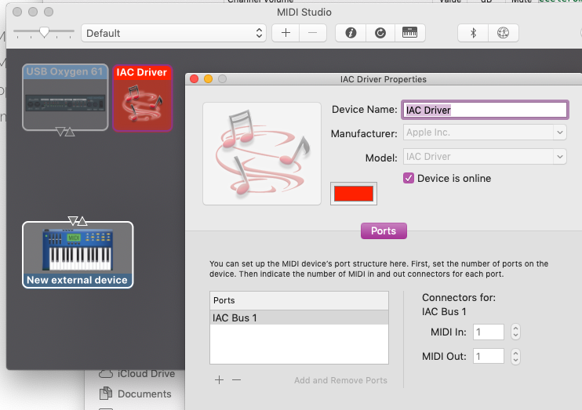

# hackfest.lol / The Odor's LED Dance Floor

This is our entry to [hackfest.lol](https://hackfest.lol). We are 
[Nevyn Bengtsson](mailto:nevyn.jpg@gmail.com),
[Mai-Li Hammargren](mailto:maili@icloud.com) &
[Emma Koszinowski](mailto:emkosz@gmail.com).

Our dance floor has six tiles. When you step on a tile, it lights up and sends
a MIDI signal to a connected computer, which can then play music based on the
MIDI signal. Here's our demo from the hackathon, which gave us first place:

<iframe width="560" height="315" src="https://www.youtube.com/embed/AkNP8b4DwMU" frameborder="0" allow="accelerometer; autoplay; encrypted-media; gyroscope; picture-in-picture" allowfullscreen></iframe>

## High level overview

The base is a wooden structure. Under each tile, ten AdaFruit NeoPixel LEDs are
mounted. They're all connected up in series, for a total of 60 leds. The signal
pin of the LEDs is connected to pin 6 on an Arduino.

Then, six transparent plastic boxes are mounted upside-down on top of the 
LED strips. Simple push buttons are hot-glued onto the middle of the underside
of the boxes, facing up. Two cables go from each button: black to ground,
and each box to Arduino pin 8-12, which become input pins.

The boxes' lids are then mounted on top of the underside of the boxes, resting
on the buttons without pressing them. The whole thing is taped down with gaffa.

Stepping on the box lid thus depresses the buttons, sending a signal to the
Arduino, which activates the corresponding LEDs and sending the correct MIDI
signal.

## How to use it

First, connect the Arduino to your computer. Then, enable MIDI:

1. Open Audio MIDI Setup.app
2. From the Window menu, select "Show MIDI Studio"
3. Double click IAC Driver
4. Click "Device is online"
5. Make sure it has a Bus

6. Download and install [The Hairless MIDI to Serial Bridge](http://projectgus.github.io/hairless-midiserial/)
7. Under Serial Port, Select the Arduino
8. Under MIDI Out, select "IAC Driver Bus 1"
9. Click "Serial<> MIDI Bridge On"

10. Open Garage Band, and setup an instrument of your choice
11. If you're lucky, when you step on a tile, MUSIC COMES OUT!!!

## How to build it

### Bill of materials

* 1x base structure, like a pallet or something.
* 1x Arduino. I used a Mega, but a Uno probably works as well.
* 1x USB-B cable, to wire Arduino to your Mac. Pretty long.
* 60x AdaFruit NeoPixel, or clone. RGB, pretty close together.
* 6x push buttons.
* 6x transparent lunch boxes, pretty big and sturdy.
* Lotsa wires in different colors

### Equipment

* Gaffer tape or something
* Hot glue :D
* Soldering iron

### Build instructions

eh. maybe some day :) 

You could probably figure it out based on the source code. The variables at the
top makes it very configurable based on your build, if you do it your own way.